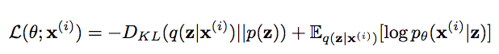
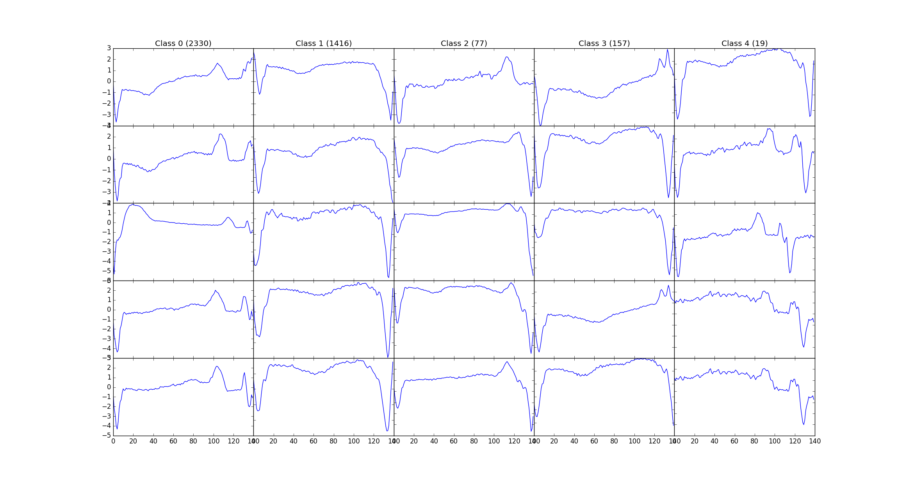

# Anomaly-detection-on-ECG-signals

This project classifies ECG signals as NORMAL, WARNING and CRITICAL (i.e. Abnormal) based on a semi-supervised approach. A Variational AutoEncoder (VAE) is developed and training on NORMAL ECG signals. Then the rest 

Additionally, a detailed analysis on the latent space is included

## Loss function

The network is jointly trained on 2 loss functions:

1. KL-divergence between the distribution learned in latent space with the normal distribution.
2. An auto-encoder learns the identity function, so the sequence of input and output vectors must be similar. In our case, MSE loss is calculated between x_decoded and x forming the reconstruction error. It signifies the extent to which input is reconstructed.

## Data

The above network is trained on a dataset of 8500 ECG's and tested on 950 ECG's Named ECG5000 on the UCR archive, this dataset has 5 classes, and the labels are used to generate different colors on PCA, tSNE chart.

Here's a snapshot of the data: 

## Requirements

Repo works with:

python>=3.7

tqdm==4.62.3
matplotlib==3.5.1
numpy==1.21.2
torch==1.7.0
pandas==1.3.5
scikit-learn==1.0.2
seaborn==0.11.2
